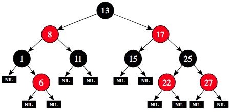

# Red-Black Tree

A red–black tree is a kind of self-balancing binary search tree  
`nil` nodes are treated as leaves

### Properties

1. every node either red or black
2. root is black
3. leaves are black
4. if a node is red, then its children are black
5. all paths from a node to descendant leaves contain same #black nodes

property 4 implies that:
* two consecutive red nodes should not appear
* if a node is red, all adjacent nodes (children and parent) must be black



### black-height:

number of black nodes on any path from, but not including, a node `x` down to a leaf is called black-height of the node, denoted by `bh(x)`

* `nil`s have black-height `0`
* black-height of red-black tree = black-height of its root

for convenience, we use sentinel in place of `null` pointer. except `color` 
rest of fields in sentinal are immaterial, even if they are set during operations

---

## Insert

do BST insertion, and fix any RBT property violations

```java
void insert(RBT t, Node n) {
    // do search. x traces path and xp is maintained as parent of x
    Node x = t.root;
    Node xp = x.parent;
    while(x!=t.nil) {
        xp = x;
        if(n.data<x.data)
            x = x.left;
        else
            x = x.right;
    }

    // note: xp must either leaf or has single child
    n.parent = xp;
    if(xp==t.nil) // tree is empty
        t.root = n;
    else if(n.data<xp.data)
        xp.left = n;
    else
        xp.right = n;

    n.left = t.nil;
    n.right = t.nil;
    n.color = RED;
    insertFixup(t, n);
}
```

when new node is inserted and colored `RED`, which properties can be violated:
1. certainly continues to hold
2. **violated** if tree was empty
3. holds, because children of newly inserted node are sentinel `t.nil`
4. **violated** if parent of newly inserted node is `RED`
5. holds, because new node replaces black leaf and new node is red with to black leaves

*why new node is colored RED ?*  
if new node is colored BLACK, property 5 will be violated which is hard to fix

```java
void insertFixup(RBT t, Node z) {
    while(z.parent.color==RED) { // property 4 violated
        if(z.parent==z.parent.parent.left) { // z has left-parent
            /*   (C)
                 /
               {A}    
                |
               {B}z   */
            Node y = z.parent.parent.right; // z's uncle i.e. parent's sibling
            if(y.color==RED) { // case1: uncle is RED
                /*  (C)                       {C}z
                    / \                       / \
                  {A} {D}y  --recolor-->    (A) (D)y
                   |                         |
                  {B}z                      {B}              */
                z.parent.color = BLACK;
                y.color = BLACK;
                z.parent.parent.color = RED;
                z = z.parent.parent;
            } else { // uncle is BLACK
                if(z==z.parent.right) {
                    // case2a: z, z parent, z grandparent are not aligned
                    /*    (C)                           (C)
                          / \                           / \
                        {A} (D)y  --leftRotate(A)-->  {B} (D)y
                          \                           / 
                          {B}z                      {A}z        */
                    z = z.parent;
                    leftRotate(t, z);
                }
                // case2b: z, z parent, z grandparent are aligned
                /*    (C)                            {B}                     (B)
                      / \                           /   \                   /   \
                    {B} (D)y  --rightRotate(C)--> {A}z  (C)  --recolor--> {A}z  {C}
                    /                                     \                       \
                  {A}z                                    (D)                     (D)
                */
                rightRotate(t, z.parent.parent);
                z.parent = BLACK;
                z.parent.right = RED;
                // now t satisfies property 4
            }
        } else { // z has right-parent
            // same as if clause with left and right exchanged
        }
    }
    t.root.color = BLACK; // fix property 2
}
```

Insights:
* `while` loop repeats only in `case 1` and `z` moves two levels up the tree
* `case 2a` results in `case 2b`
* after `case 2b` while loop terminates
* it never performs more than two rotations

Running-Time: `$O(\log_2 n)$`

---

## Delete

do BST delete, and fix any RBT property violations

```java
Node delete(RBT t, Node n) {
    // find the node to be sliced out
    Node splice;
    if(n.left==t.nil || n.right==t.nil)
        splice = n;
    else
        splice = successor(t, n);

    // find non-null child of splice
    Node spliceChild;
    if(splice.left!=t.nil)
        spliceChild = splice.left;
    else
        spliceChild = splice.right;

    // splicing out
    if(spliceChild!=t.nil)
        spliceChild.parent = splice.parent;
    if(splice.parent==t.nil)
        t.root = spliceChild;
    else if(splice=splice.parent.left)
        splice.parent.left = spliceChild;
    else
        splice.parent.right = spliceChild;

    if(n!=splice)
        n.data = splice.data

    if(splice.color==BLACK)
        deleteFixup(t, spliceChild);
    return splice;
}
```

if `splice` is `RED`, RBT properties still hold:
* no black-heihts in tree are changed
* no red nodes have been made adjacent
* since `splice` is `RED`, it could not be root. thus root remains `BLACK`
