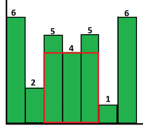

# Largest Rectangle Area in Histogram

In given histogram, find largest rectangle area formed by contiguous bars ?  
All bars has width 1 unit.

`hist[] = { 6, 2, 5, 4, 5, 1, 6 }`

  
Max Area = `3*4` = `12` (shown in red)

## Logic

For every bar `x`, find largest rectangle formed with `x` as smallest bar in that rectangle. Then maximum of all such areas gives answer.

**How to find area with `x` as smallest bar?**


* find first smallest bar on left of `x`. leftIndex = 1
* find first smallest bar on right of `x`. rightIndex = 5
* then no of bars in rectangle = rightIndex-leftIndex-1 = 3
* so area = 3\*4 = 12

**How to find leftIndex and rightIndex of each bar efficiently ?**

Use stack

* scan histogram from left to right and push them(indexes) into stack
    * before pushing, pop bars that are larger than that
        * when a bar is popped, its
            * rightIndex = currentIndex
            * leftIndex   = top index in stack (-1 if empty)
      
```java
int maxArea(int hist[]){
	int maxArea = 0;
	Stack stack;
	for(int i=0; i<hist.length; i++){
		while(!stack.isEmpty() && hist[stack.peek()]>hist[i]){
			int minBar = hist[stack.pop()];
			int leftIndex = stack.isEmpty() ? -1 : stack.peek();
			int area = minBar*(i-leftIndex-1);
			if(area>maxArea)
				maxArea = area;
		}
		stack.push(i);
	}
	return maxArea;
}
```

Running Time: `$O(n)$`

### References

* <http://www.geeksforgeeks.org/largest-rectangular-area-in-a-histogram-set-1/>
* <http://www.geeksforgeeks.org/largest-rectangle-under-histogram/>

